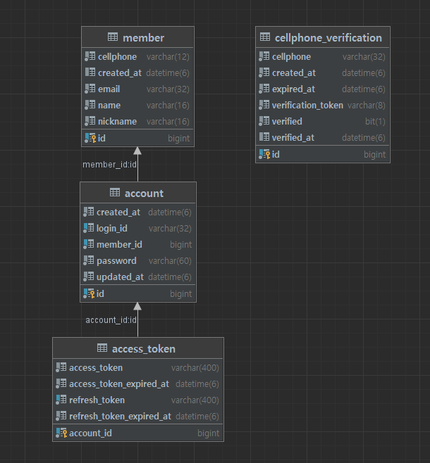

### 설계 내용
* erd : member-account는 1:N, account-access_token은 1:1


### 구현(Tech Stack)
1. 언어
    1. 코틀린 1.6.21
    2. 자바 17
2. 주요라이브러리
    1. 스프링 2.7
    2. jpa
    3. jjwt 
3. 인프라스트럭처
    1. DB: mysql 8

### 테스트
* 스프링 부트 테스트로 실행시 테스트 데이터베이스는 H2를 사용하도록 셋팅을했습니다.
* 인텔리제이의 http client 파일을 http-test/test.http 에서 확인 가능합니다.

### 실행방법
* 도커데스크탑이 설치및 실행되어 있어야합니다.
* java 17이 설치되어있어야합니다.
* ```docker compose up -d```
* ```./gradlew build```
* ```java -jar ./build/libs/UserPractice-0.0.1-SNAPSHOT.jar```